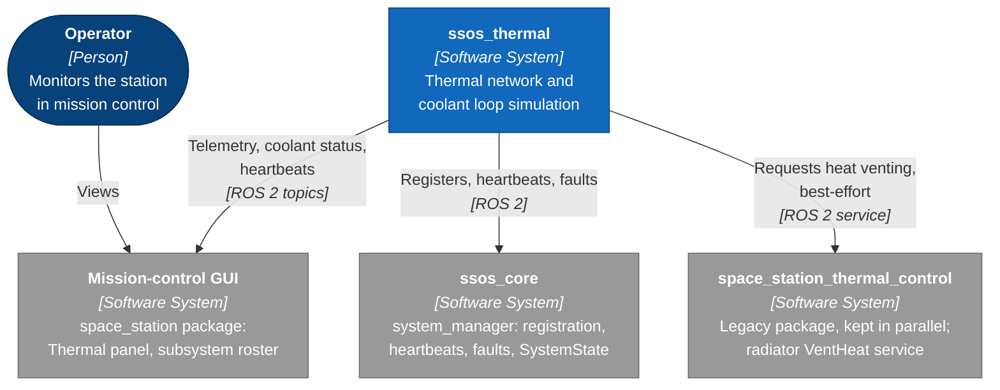
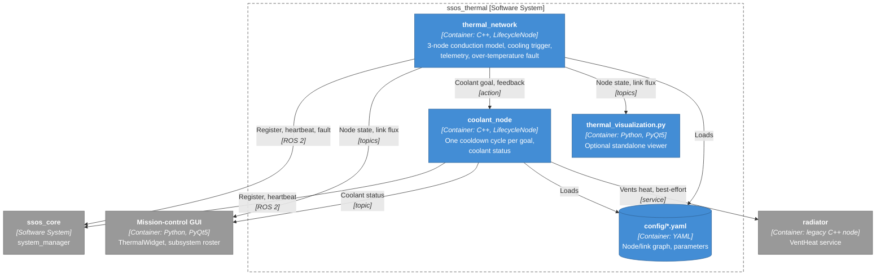
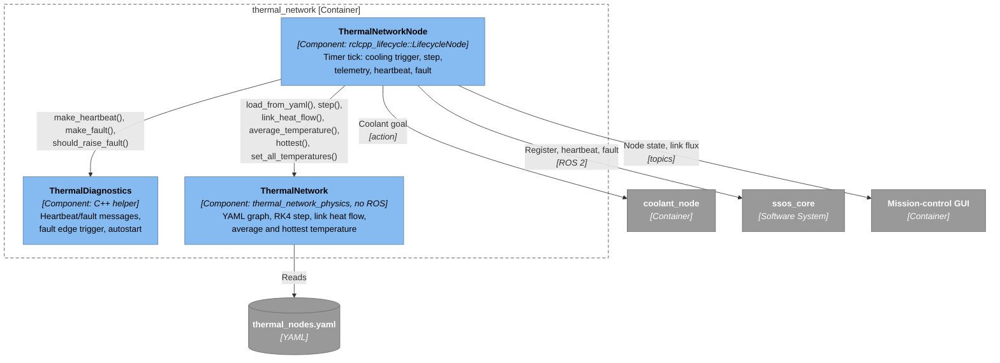
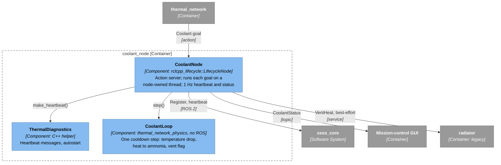
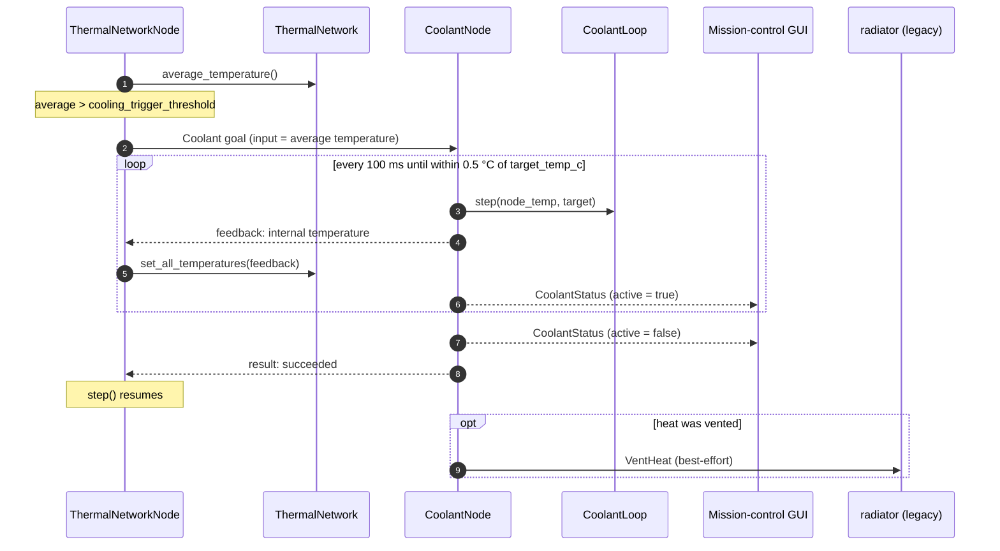
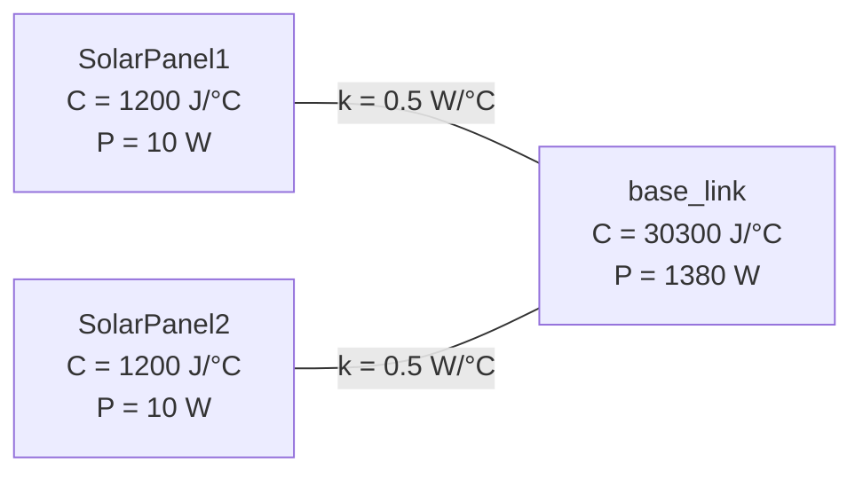

# Architecture

`ssos_thermal` simulates the station's thermal network and coolant loop on
the SSOS subsystem backbone, following the same physics/ROS split as
`ssos_eclss` (see [ECLSS_PATTERN_REFERENCE.md](../ECLSS_PATTERN_REFERENCE.md)).

The structure is drawn as a [C4 model](https://c4model.com):

1. **System context** — `ssos_thermal` and the systems around it
2. **Containers** — the processes and configuration inside `ssos_thermal`
3. **Components** — the classes inside each node process
4. **Dynamic** — one cooling cycle, step by step

The diagrams are Mermaid flowcharts in C4 notation rather than Mermaid's
`C4Context`/`C4Container` syntax, whose fixed-row layout overlaps
labels at this size. Colors follow the C4 convention: dark blue = person,
blue = the system in scope, mid blue = container, light blue = component,
grey = external. Dashed boxes are system or container boundaries. Each
element is labeled with its name, *[type: technology]*, and responsibility;
each arrow with its purpose and *[transport]*.

The thermal and coolant models (formulas) follow the diagrams.

## 1. System context

`ssos_thermal` takes no input from `ssos_sim`: `thermal_network` does not
subscribe to `/sim/world_state`, so its only heat sources are the YAML
`internal_power` values.

## 2. Containers

| Interface | Type | From → to |
|---|---|---|
| `/ssos/register_subsystem` | `RegisterSubsystem` service | both nodes → `system_manager` |
| `/ssos/thermal/heartbeat`, `/ssos/coolant/heartbeat` | `SubsystemHeartbeat` | → `system_manager`, GUI roster |
| `/ssos/fault_event` | `FaultEvent` | `thermal_network` → `system_manager` |
| `/thermal/nodes/state` | `ThermalNodeDataArray` | `thermal_network` → GUI, viewer |
| `/thermal/links/flux` | `ThermalLinkFlowsArray` | `thermal_network` → GUI, viewer |
| `/thermals/diagnostics` | `DiagnosticStatus` | `thermal_network` → telemetry consumers |
| `/coolant_heat_transfer` | `Coolant` action | `thermal_network` → `coolant_node` |
| `/thermal/coolant/status` | `CoolantStatus` | `coolant_node` → GUI |
| `/tcs/radiator_a/vent_heat` | `VentHeat` service | `coolant_node` → legacy `radiator` |

Command and monitoring are separate. Only `thermal_network` sends
`Coolant` goals; a goal actuates the loop and can trigger radiator venting.
The GUI only reads `/thermal/coolant/status`, published at 1 Hz and on
every cooldown step; before the first cycle it reports idle values (loop at
`target_temp_c`, nothing vented). The GUI roster rolls the `thermal` and
`coolant` heartbeats into one "THERMAL" row.

## 3. Components

Each node process holds a thin ROS layer over a physics object. The
physics library (`thermal_network_physics`) links nothing from ROS; only
`thermal_network_ros` depends on `rclcpp`, `rclcpp_lifecycle`,
`rclcpp_action`, and `space_station_interfaces`.

### `thermal_network`

### `coolant_node`

`coolant_node` accepts one goal at a time and only while `ACTIVE`. The
goal thread is owned by the node: deactivate, cleanup, and destruction
stop and join it, and a running goal is aborted at its next step.

## 4. Dynamic: one cooling cycle

Drawn in sequence form, which C4 allows for dynamic diagrams.

## 5. Thermal network model

`config/thermal_nodes.yaml` defines a 3-node star:

Each node $i$ obeys a lumped-mass energy balance — internal heat
generation plus conduction to its linked neighbors, no radiation or solar
input yet:

$$
C_i \frac{dT_i}{dt} = P_i + \sum_{j} k_{ij} \left( T_j - T_i \right)
$$

| Symbol | Meaning |
|---|---|
| $T_i$ | node temperature [°C] |
| $C_i$ | `heat_capacity` [J/°C] |
| $P_i$ | `internal_power` [W], constant |
| $k_{ij}$ | `conductance` [W/°C] of the link between $i$ and $j$ |

`ThermalNetwork::step(dt)` integrates all three ODEs together with
classic 4th-order Runge-Kutta, every `thermal_update_dt` seconds. A node
only exchanges heat over a link whose other end is itself a declared node —
`base_link` has no `parent_link` (it's the root), so it gets no link of
its own; `SolarPanel1`/`SolarPanel2` each link to it.

The heat flow published per link on `/thermal/links/flux` is the same
conduction term, computed by `ThermalNetwork::link_heat_flow()`:

$$
\dot{Q}_{a \to b} = k_{ab} \left( T_a - T_b \right)
$$

positive when heat moves from `node_a` to `node_b`, and 0 for a link whose
other end isn't a declared node.

There is no heat sink in this model (no radiation to space): total energy
only rises until the coolant loop intervenes. `base_link`'s
`heat_capacity`/`internal_power` are the *sums* of the ~46 individual
equipment nodes this package used to model separately — the aggregate
mass/power budget is unchanged, only the graph is simpler now. See
[REFACTOR_PLAN.md](../REFACTOR_PLAN.md) for the reduction and a dead-link
bug it fixed.

## 6. Coolant loop model

`ThermalNetworkNode` sends a `Coolant` action goal to `coolant_node`
once `average_temperature() > cooling_trigger_threshold`. `CoolantLoop`
then runs this per-step model (one step every ~100 ms) until the node
settles within 0.5 °C of `target_temp_c`:

$$
\begin{aligned}
\Delta T &= \min\left(2.5,\ T_{in} - T_{target}\right) && \text{[°C, capped per step]} \\
Q &= \frac{m \cdot c_p \cdot \Delta T}{1000} && \text{[kJ removed from the loop]} \\
Q_{NH_3} &= Q \cdot \eta && \text{[kJ transferred to ammonia]} \\
T_{NH_3} &= 5.0 + \frac{Q_{NH_3}}{1000} && \text{[°C, simplified/unvalidated]} \\
\text{vent} &= Q_{NH_3} \geq Q_{vent} \\
T_{out} &= T_{in} - \Delta T
\end{aligned}
$$

| Symbol | Meaning |
|---|---|
| $m$ | `mass_kg` — internal coolant loop water mass [kg] |
| $c_p$ | `specific_heat_j_per_kg_c` [J/(kg·°C)] |
| $\eta$ | `heat_transfer_efficiency` — fraction of removed heat transferred to ammonia |
| $Q_{vent}$ | `vent_threshold_kj` — ammonia heat above which a radiator vent is requested |

While a cooling goal is in flight, `ThermalNetworkNode` pauses its own
`step()` and instead snaps **all** node temperatures to each feedback
value (`set_all_temperatures()`) — this cooldown loop is the only heat
sink anywhere in the package. The radiator call degrades gracefully: if
the legacy `radiator` isn't running, `coolant_node` logs it and continues.

## 7. Lifecycle

`thermal_network` and `coolant_node` both self-activate via
`ThermalDiagnostics::maybe_autostart` (configure then activate
`autostart_delay_ms` after construction) — `launch/thermal.launch.py`
never sends a lifecycle `ChangeState`, same mechanism as
`ssos_eclss/launch/eclss.launch.py`. In the full-station launch the delay
is 11 s, after `system_manager` activates at 10 s.

## Further reading

- [parameters.md](parameters.md) — every tunable parameter, per node
- [fault_catalog.md](fault_catalog.md) — the one fault type, edge-triggered
- [commands.md](commands.md) — build/launch/inspect/test commands
- [REFACTOR_PLAN.md](../REFACTOR_PLAN.md) — history: why each design
  decision was made, what was intentionally left out of each port
